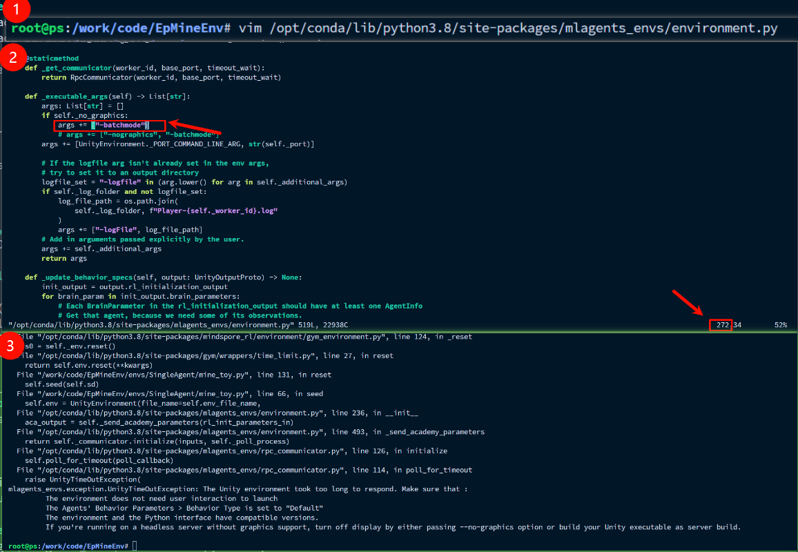

# DRL4EPMine

## 任务描述

在固定环境内，根据第一视角图像输入，找到指定目标。

状态：第一视角图像，尺寸为128x128

动作：机器人横向速度、纵向速度和旋转角速度

奖励：机器人到达指定位置会返回+10奖励，在`envs/SingleAgent/mine_toy.py`中设置了一种简易稠密奖励方式。

对环境的测试可以参考`envs/SingleAgent/mine_toy.py`文件。

## 环境配置

### Windows端

```bash
pip install stable-baselines3[extra]
# 注意这个包安装后可能需要降级 protobuf==3.20.3
pip install mlagents-envs

```

### linux端配置

(1) opencv-python系统依赖缺失

```bash
# error
File "/workspace/drl_ep/envs/singleAgent/mine_toy.py", line 9, 
    in <module> import cv2 as cv 
    ImportError: libGL.so.1: cannot open shared object file: No such file or directory

# 解决
apt install libgl1
```

(2)

```bash
# error
mlagents_envs.exception.UnityEnvironmentException: Error when trying to launch environment - make sure permissions are set correctly
# 解决
chmod -R 775 MineField_Linux-0510-random/drl.x86_64
```

### docker记录

容器创建，

```bash
docker run -itd \
  -p 50004:80 \
  --security-opt seccomp=unconfined \
  --shm-size=512m \
  --gpus all \
  -v /home/disk/sdb/one/zwb/workspace:/workspace:rw \
  --name demo1 \
  novnc_torch:ep.mine

```

一些依赖配置问题，

```bash

# protobuf依赖降版本问题，原有操作似乎重装不干净

# 先手动卸载
rm -rf /usr/local/lib/python3.12/dist-packages/google/protobuf

# 重装
pip install --no-cache-dir --break-system-packages protobuf==3.20.3
```

运行指令，环境变量

```bash
# 修复 XDG_RUNTIME_DIR 错误
# 创建用户运行时目录（临时修复）
sudo mkdir -p /run/user/$(id -u)  # 需 root 权限创建

# 配置
export XDG_RUNTIME_DIR=/run/user/$(id -u)

# 设置目录所有者（替换为你的实际用户名） 
chown $(whoami):$(whoami) /run/user/$(id -u)

export XAUTHORITY=$HOME/.Xauthority

```

运行程序

```bash
# 挂载目录权限问题，暂时用sudo解决
sudo python3 train_ppo.py
```

### 关闭可视化界面

mlagents-envs提供了`no-graphics`仿真模式，但是在该模式下图像不会被正常渲染。
这里我们提供了一种通过修改mlagents-envs源码的方式，让它们支持不显示可视化窗口。
具体的，找到当前python环境的库安装路径，并找到`site-packages/mlagents_envs/environment.py`，将第272行
`args += ["-nographcis", "-batchmode"]` 修改为 `args += ["-batchmode"]`。

补充：实际测试发现错误。



然后再代码（`envs/SingleAgent/mine_toy.py`）中 `no_graph = True`。

需要注意的是，上述修改方式虽然支持关闭可视化窗口，但是在服务器（无显示）端仅修改上述代码而不适用docker的情况下，仍然不能正常渲染图像。

***警告***：上述代码涉及修改mlagents-envs源码，请谨慎使用。

## 仿真环境下载

在[release](https://github.com/DRL-CASIA/EpMineEnv/releases)标签下，下载最新的系统对应的仿真环境，解压到`envs/SingleAgent/`路径下，并检查`envs/SingleAgent/mine_toy.py`中的`file_name`路径是否正确。
